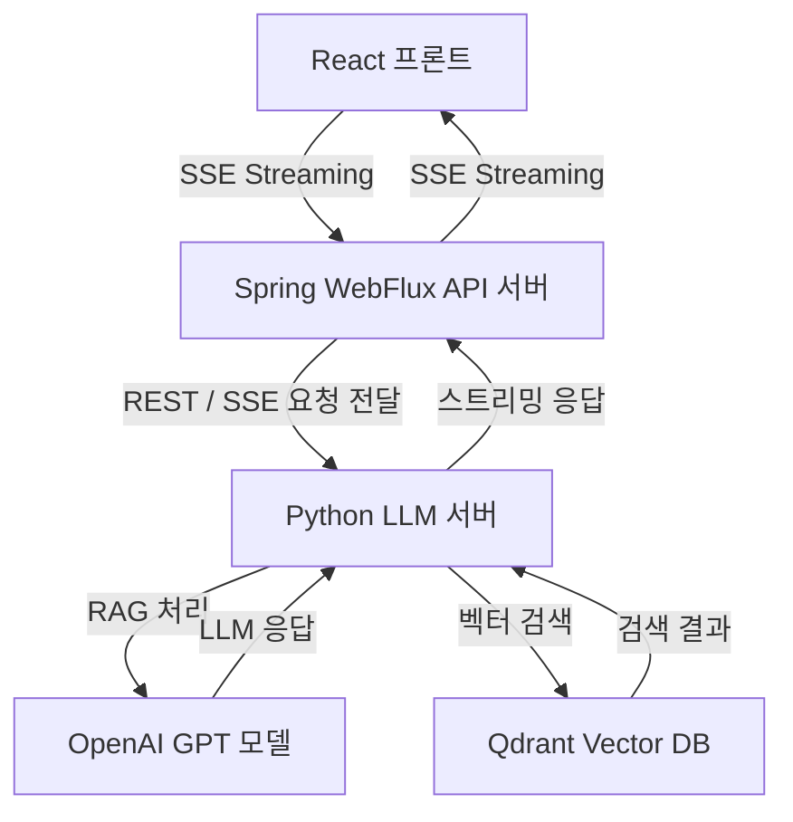

# 정치인 검색 AI

## Demo URL
- 서비스 Demo URL: <a href="https://ai.1000square.com" target="_blank">ai.1000square.com</a>

## 서비스 특징
* 대한민국 국회의원·정당·선거 데이터를 기반으로 한 정치인 전문 검색 LLM
* Qdrant 기반 벡터 검색 + RAG(Retrieval-Augmented Generation) 구조
* 이름·지역·정당·선거 이력 등 다양한 형태로 질의 가능
* 여러 정치인 비교 가능
* FastAPI 기반의 SSE Streaming 응답 지원
* 현재는 OpenAI API 사용중이나 추후 Local LLM 사용 가능

## 서비스 아키텍처 (구조)

**React 프론트 → Spring WebFlux API → Python LLM(RAG) 서버 → Qdrant 벡터 DB** 로 구성된  
'비동기 스트리밍 기반' 정치인 검색 AI 시스템입니다.

## 주요 기능
1. 이름 기반 정치인 검색
- 사용자 질문에서 자동으로 이름을 추출하고, 벡터 임베딩(NamedVector)을 통해 가장 유사한 정치인을 검색
- 예: "이재명은 누구야?" / "이준석 경력 알려줘"

2. 여러 정치인 비교
- 질문에서 여러 이름을 추출 -> 각 임베딩 생성 -> 복수 payload 기반 RAG 수행
- 예: "윤석열과 이재명 비교해줘" / "이준석 vs 안철수 누가 더 젊어?"
